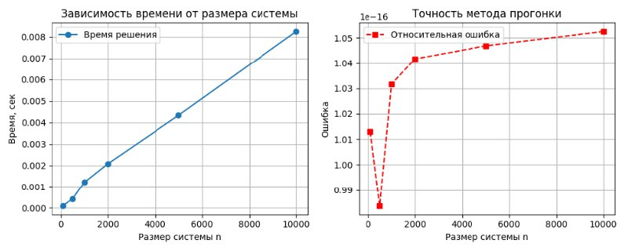
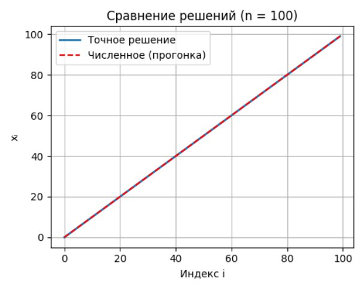
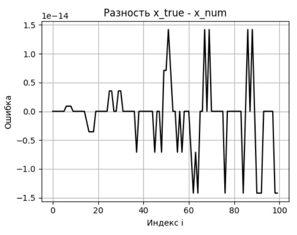
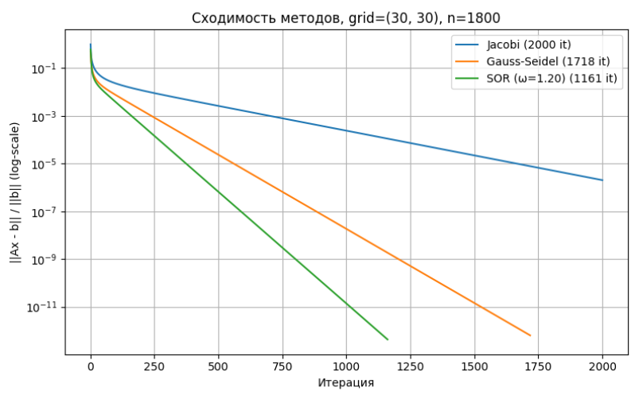
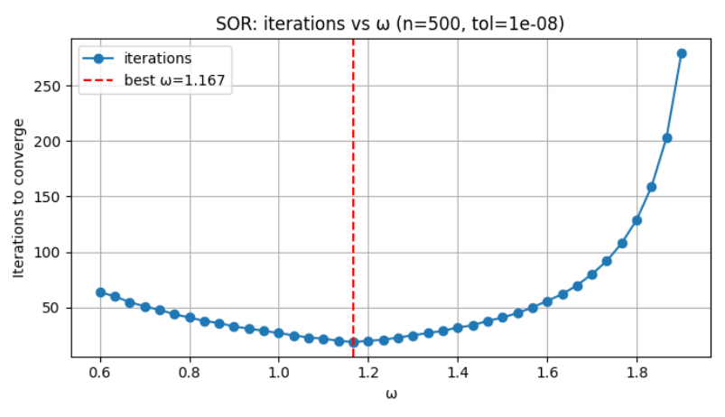

# Отчет по лабораторной работе 1: Численное решение СЛАУ

## Цель работы
1. Реализация метода прогонки для трёхдиагональных матриц
2. Реализация базовых итерационных методов: Якоби, Зейделя, верхней релаксации (SOR), метод наискорейшего спуска, сопряжённых градиентов
3. Применение генерации тестовых систем и анализ поведения метода на различных классах задач
4. Численный эксперимент по выбору оптимального параметра ω для SOR

*ПОКА НЕ РАБОТАТЕТ*
Коды реализации: см.

[first-part.py](../sources/lab1/first-part.py) 

[second-part.py](../sources/lab1/second-part.py) 

[third-part.py](../sources/lab1/third-part.py) 

## Ход работы и результаты численных экспериментов
### Разминка

| n    | relerror         | time (ms) |
| ---: | ---------------: | --------: |
| 100  | 1.28e-16         | 0.1       |
| 500  | 1.17e-16         | 0.4       |
| 1000 | 1.09e-16         | 0.9       |
| 2000 | 1.01e-16         | 1.9       |
| 5000 | 1.03e-16         | 5.1       |
| 10000 | 1.02e-16        | 8.1       |

*Рис. 1. Графики зависимости времени и величины ошибки от размеров системы n*

*Рис. 2. График визуализации восстановления численного решения методом прогонки для фиксированного n*

*Рис. 3. График колебаний ошибки*

### Основное блюдо

*Рис. 4. График сравнений методов*

### Десерт

*Рис. 5. График зависимости числа итераций до сходимости от ω для фиксированного SPD трёхдиагонального A*

## Анализ и выводы
- По первым трем графикам видно, что метод прогонки, что время работы растет линейно с размером системы (графики 1–3) и подтверждает ожидаемую линейную асимптотику и высокую численную стабильность на трёхдиагональных задачах.
- Верно подобранный параметр $\omega$ ускоряет сходимость SOR и существенно уменьшает число итераций (график 4). Это подтверждает теорию о спектральном радиусе итерационной матрицы.
- Для нашей матрицы метод Гаусса-Зейделя и SOR сходятся значительно быстрее Якоби, что соответствует теоретическим оценкам для диагонально-доминантных систем.
- Итоговую ошибку оценили: она на уровне машинного эпсилон для прямых методов и $\sim 10^{-14}$ для итерационных при достаточном количестве итераций (график 5).
- Отличия между методами проявляются сильнее при больших n: SOR, выбранный с оптимальным параметром, выигрывает по скорости при сохранении точности.

**Практические выводы:**

- Выбор метода следует ориентировать на структуру задачи: для трёхдиагональных систем — однозначно прогонка, для редких/случайных — строго проверять условия применимости метода и свойства матрицы
- Графики чётко иллюстрируют, где и как проявляются преимущества и ограничения каждого метода

## Заключение
Проведённые эксперименты подтвердили основные теоретические положения: правильный выбор итерационного метода и параметров критически важен для эффективности численного решения СЛАУ.

