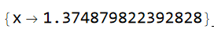

# Отчет по лабораторной №2: Численныеметоды решения нелинейных уравнениий

## 1. Цели работы
- Сравнить сходимость, надёжность и скорость методов на тестовых задачах
- Визуализировать области притяжения метода Ньютона для комплексных корней

## 2. Ход работы и результаты численных экспериментов

### Разминка

В ходе разминки было решено методами дихотомии, прстой итерации и Ньютона следующее уравнение: 

$$2\ln(x) - \cos(\ln(x)) + \sin(\ln(x)) = 0$$

В результате численных расчетов каждый из методов дал свой результат с характерной ему ошибкой:

**Таблица 1 - Сравнение результатов численного решения уравнения различными методами**
| Solver                  | Root           | Iterations | Residual              | Time (μs) |
|-------------------------|----------------|------------|-----------------------|-----------|
| Dihotomia               | 1.374879822392359   | 40         | 1.113e-12             | 90        |
| Simple Iteration        | 1.374879822393232   | 23         | 9.593e-13             | 45        |
| Newton                  | 1.374879822392828   | 5          | 2.220e-16             | 23        |

В свою очерель Wolfram Mathematica показывает следующищй результат решения уравнения: 

**Выводы**

`Метрод Дихотомии` имеет сравнительно неплохую точность, однако вместе с этим самый непроизводительный метод среди трех представленных

`Метрод Простой итерации` показывает худшую точность с дихотомией, однако при этом более оптимизированный

`Метрод Ньютона`- самый лучший резульат по всем сравниваемым критериям: наименьшее затраченное время и количество итераций при наилучшей точности

 ### Основное блюдо

 

 

