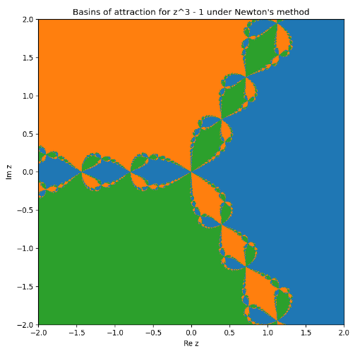

# Отчет по лабораторной №2: Численныеметоды решения нелинейных уравнениий

## 1. Цели работы
- Сравнить сходимость, надёжность и скорость методов на тестовых задачах
- Визуализировать области притяжения метода Ньютона для комплексных корней

## 2. Ход работы и результаты численных экспериментов

### Разминка

В ходе разминки было решено методами дихотомии, прстой итерации и Ньютона следующее уравнение: 

$$2\ln(x) - \cos(\ln(x)) + \sin(\ln(x)) = 0$$

В результате численных расчетов каждый из методов дал свой результат с характерной ему ошибкой:

**Таблица 1 - Сравнение результатов численного решения уравнения различными методами**
| Solver                  | Root           | Iterations | Residual              | Time (μs) |
|-------------------------|----------------|------------|-----------------------|-----------|
| Dihotomia               | 1.374879822392359   | 40         | 1.113e-12             | 90        |
| Simple Iteration        | 1.374879822393232   | 23         | 9.593e-13             | 45        |
| Newton                  | 1.374879822392828   | 5          | 2.220e-16             | 23        |

В свою очерель Wolfram Mathematica показывает следующищй результат решения уравнения: 

**Выводы**

`Метрод Дихотомии` имеет сравнительно неплохую точность, однако вместе с этим самый непроизводительный метод среди трех представленных

`Метрод Простой итерации` показывает худшую точность с дихотомией, однако при этом более оптимизированный

`Метрод Ньютона`- самый лучший резульат по всем сравниваемым критериям: наименьшее затраченное время и количество итераций при наилучшей точности

---

 ### Основное блюдо
В ходе выполнения основного блюда решалась задача о расстоянии центра шара шара с радиусом **R** и плотностю материала $\rho_м$  над жидкостьюю с плотностью $\rho_ж$ в зависимости от плотоности первого. 
#### Физическая постановка задачи 
##### Переменные

- $\rho_м$ — плотность матреиала шира
- $\rho_ж$ — плотонсть жидкости
- $R$ — радиус шара
- $V$ — объем погруженной части шара 
- $h$ — высота погруженнной части шара

##### Основные уравнения

$$
\rho_ж g V = \rho_м g \frac{4}{3}\pi R^3
$$

Расписывая объем купола под водой как 

$$
V = \frac{1}{3}\pi h^2 (3R-h)
$$

Подставляем его в исходное равенство, группируем несложной алгеброй получившееся выражение и получаем следующее выражение, дающее высоту погружения в зависимости от отношения плотонстей: 

$$
f(\frac{\rho_ш}{\rho_ж}) = h^2(3R-h) - 4R^3\frac{\rho_ш}{\rho_ж} = 0
$$

Ну и переписывая относительно искомой h получаем уравнение, которое и требуется решить:

$$
h^3 - 3Rh^2 + 4R^3\frac{\rho_ш}{\rho_ж} = 0
$$

##### Решаем выведенную задачу освоенными методами

**График 1 — Получившаяся зависимость для метода Ньютона**

##### Немного проанализируем:

- График четко отражает, что граничная плотность материала шара, при которой центр шара был не под водой равна 0.5
- Далее по мере роста $\rho_ш$ к $\rho_ж$ кривая монотонно убывает, причём ближе к $\rho_ш = \rho_ж$ наблюдается резкое падение $d$ до значения около $-R$, что соответствует переходу от частичного погружения к полному.
- Плавное, почти линейное убывание $d$ при $\rho_ш$ < $\rho_ж$ соответствует тому, что из уравнения Архимеда глубина погружения (а значит и расстояние от центра до поверхности) растёт с плотностью шара, причём зависимость определяется решением кубического уравнения и не содержит изломов до момента полного погружения.

Что касается чисел, то результаты выглядят следующим образом:

**Таблица 2 - Результаты численного решения задачи различными методами**
| Solver                  | Root     | Iterations | d          |
|-------------------------|----------|------------|------------|
| Bisection               | 1.134138 | 20         | -0.134138  |
| Simple Iteration        | 1.127492 | 100        | -0.127492  |
| Newton                  | 1.134138 | 2          | -0.134138  |

где $d$ - расстояние от центра шара до поверхности воды, вычисленная как $d = R - h$ 

---

### Визуализируем области притяжения метода Ньютона для комплексных корней

**График 4 - Области притяжения метода Ньютона для комплексных корней**

### Описание графика

- На комплексной плоскости (ось x — Re(z), ось y — Im(z)) отображены области притяжения корней уравнения $z^3 = 1$ при использовании метода Ньютона
- Каждый пиксель соответствует начальному приближению $z_0 = x + iy$ и окрашен в цвет конечного корня, к которому сошёлся метод Ньютона из этой точки (всего 3 корня, поэтому три цвета)
- На границах между областями притяжения возникают сложные фрактальные структуры: малейшее изменение стартовой точки на границе может привести к совершенно разной траектории итераций и, соответственно, другому предельному корню

### Объяснение явления

- **Внутри каждой цветной области:** какая бы ни выбралась начальная точка, итерационный процесс Ньютона всегда сойдётся к одному и тому же ближайшему кубическому корню. Это зона устойчивого притяжения
- **Фрактальные границы:** на стыке областей: одно небольшое изменение начального приближения приводит к резкой смене предела (так называемая чувствительность к начальному условию)
- **Отсутствие белых или пустых зон:** говорит о том, что для любого стартового $z_0$, кроме особых исключений (например, $z_0 = 0$), метод Ньютона сходится к одному из трёх корней

---

## 4. Заключение и выводы 

В ходе работы сравнивались три численных метода решения нелинейных уравнений для физической модели плавающего шара. Метод Ньютона однозначно показал наилучшие качества по скорости, надёжности и физической согласованности результата. Метод дихотомии уступал по времени, а метод простой итерации оказался неудовлетворительным для таких уравнений без глубокой настройки. Выбор метода для подобных задач однозначно следует делать в пользу уточняющих (производных) алгоритмов, таких как метод Ньютона
