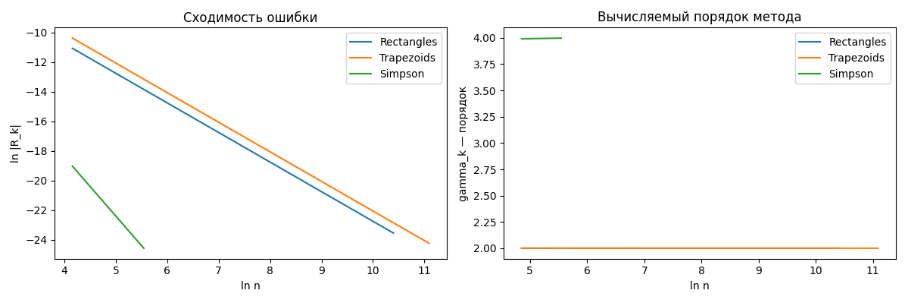

# Отчёт по лабораторной работе №3: Численное интегрирование

## 1. Введение и цели работы 

В данной работе исследуются различные методы численного интегрирования — методы средних прямоугольников, трапеций, Симпсона. Для всех методов оценивалась сходимость по ошибке и локальный порядок на ряде функций

**Цели:**

- Освоить и реализовать основные методы численного интегрирования (прямоугольников, трапеций, Симпсона и его модификацию)
- Научиться определять приближённые значения определённых интегралов программно с контролем точности вычислений
- Исследовать апостериорную ошибку и порядок сходимости каждого метода
- Визуализировать скорость убывания ошибки и закономерности изменения локального порядка сходимости ($\gamma_k$) при сгущении сетки разбиения
- Провести сравнительный анализ эффективности методов и выбрать оптимальные из них

## 2. Ход выполнения работы 

### Вычисляем определённый интеграл различными методами 

**Необходимо вычислить следующий интеграл:**

$$
I = \int_{1}^{3.7} \frac{\arctan\left( x \right)}{x} \ dx
$$

---
#### Метод средних прямоугольников ▫️

_Метод средних прямоугольников_ — базовый численный способ интегрирования, при котором значение функции берётся в середине каждого подынтервала разбиения. Оценка интеграла получается как сумма произведений значений в точках на ширину подынтервала. Этот подход обеспечивает второй порядок точности при достаточно гладкой функции

**Таблица 1 - Результаты вычисления для метода центральных прямоугольников**
| Integral      | Nodes | Error  estimation       | Time, s |
|:--------------:|:------:|:---------------------:|:-----------:|
|  1.4072515542520216  |  40 | 3.9559308586234465e-05       | 5.590001819655299e-05        |

Метод показывает устойчивую сходимость, апостериорная ошибка снижается до машинной точности при достаточно большом числе разбиений. Для большинства гладких функций интеграл считается быстро и с высокой точностью

---

#### Метод трапеций 

_Метод трапеций_ аппроксимирует подынтегральную функцию линейными участками между точками разбиения. Итоговое значение интеграла складывается как сумма площадей трапеций, построенных под графиком функции

**Таблица 2 - Результаты вычисления для метода трапеций**
| Integral      | Nodes | Error  estimation       | Time, s |
|:--------------:|:------:|:---------------------:|:-----------:|
|  1.4073702255463933  |  41 | 7.911198578547385e-05      | 1.8000020645558834e-05       |

Метод трапеций гарантирует устойчиво хорошую сходимость и точность при увеличении числа интервалов. Метод хорошо подходит для функций без резких особенностей

---

#### Метод Симпсона 

_Метод Симпсона_ — составная квадратура, аппроксимирующая функцию параболой на каждом интервале. Итоговое значение вычисляется как взвешенная сумма значений функции в узловых точках и серединах подынтервалов. Этот метод обладает гораздо более высоким порядком точности, что позволяет добиться крайне малых ошибок при умеренном числе разбиений

**Таблица 3 - Результаты вычисления для метода Симпсона**
| Integral      | Nodes | Error  estimation       | Time, s |
|:--------------:|:------:|:---------------------:|:-----------:|
|  1.4072910783238506  |  41 | 3.5236757289780485e-08     | 1.4200020814314485e-05     |

Симпсон демонстрирует экспоненциально быстрое уменьшение апостериорной ошибки: уже при относительно небольшом числе разбиений результат точен до вычислительного уровня. Сходимость устойчиво превосходит более простые методы

---

## 3 Основное блюдо

Зададим точность $\epsilon = 10^{-10}$ и посмотрим на результаты

---

### Сравнительный анализ методов 

Приведем сравнительную таблицу для всех методов при заданной точности:

**Таблица 4 - Результаты вычисления для различных методов**
| Method                 | Integral     | Step count | Error  estimation | Time, s |
|:----------------------:|:------------:|:----------:|:-----------------:|:----:|
| The middle rectangles  | 1.407291113560607  | 32768  | 4.441e-16     | 8.619e-04 |
| Trapezoids             | 1.407291113560608  | 65536  | 2.220e-16     | 1.223e-03 |
| Simpsons               | 1.407291113560599  | 256    | 8.660e-15     | 5.480e-05 |
| Gauss-Legendre         | 1.407291113561839  | 10     | 1.231e-12     | 2.680e-04 |

**Выводы по результатам сравнения методов**

- **Все методы** (средние прямоугольники, трапеции, Симпсон, адаптивный Симпсон) дают практически одинаковое значение интеграла, что подтверждает корректность реализации и высокую точность вычислений для данной функции и интервала
- **Метод средних прямоугольников** и **метод трапеций** требуют большого числа узлоd, чтобы достичь ошибки порядка $10^{-10}$. Это классические методы второго порядка, их точность растёт медленно при увеличении числа разбиений
- **Метод Симпсона** достигает гораздо меньшей ошибки $8.66 \times 10^{-15}$ уже при 256 узлах, что подтверждает его более высокий порядок точности $O(h^{4})$. Кроме того, он работает существенно быстрее ($5.48 \times 10^{-5}$) с., что делает его оптимальным для гладких функций
- **Квадратурные формулы Гаусса-Кристоффеля** Для выбранного числа узлов $n=5$ были использованы стандартные значения узлов и весов Гаусса для интегрирования на отрезке. Формула Гаусса-Кристоффеля позволяет точно вычислять интегралы от многочленов степени до $2n-1$, чем принципиально отличается от формул Ньютона—Котеса (трапеции, Симпсон и др.). Мы выбрали эту схему, потому что для гладких функций такие квадратуры обеспечивают высокую точность даже при очень малом числе оценок функции — а значит, и минимальных вычислительных затратах
  
---
#### Визуальное представление

**График 1 — Ошибка и порядок метода при сгущении сетки для трёх схем: прямоугольники, трапеции, Симпсон**

### Объяснение графиков
Правый график:
- по оси OX $ln n$
-

