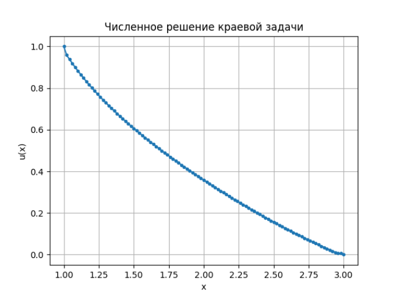
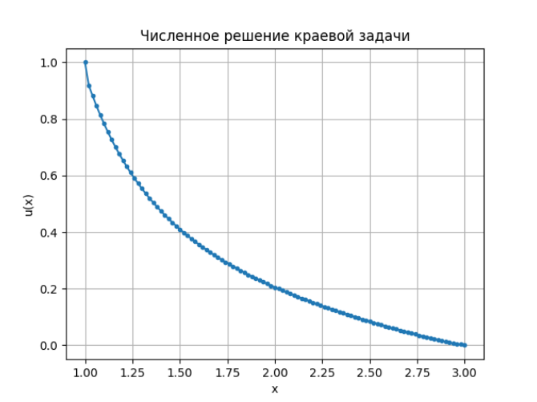
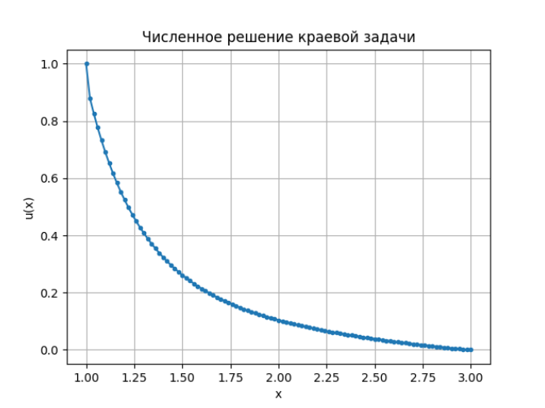
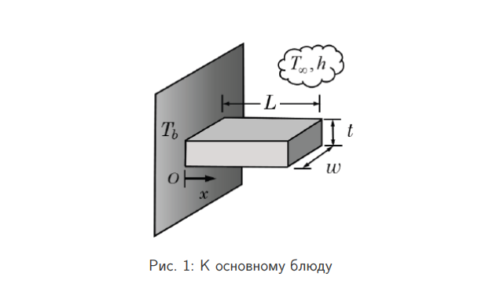
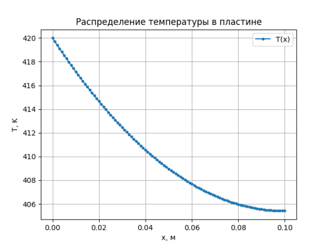
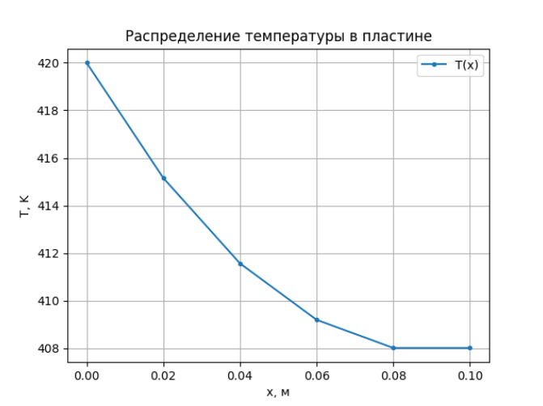
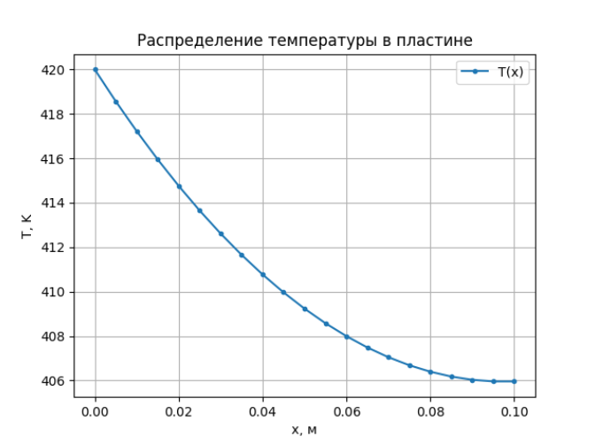
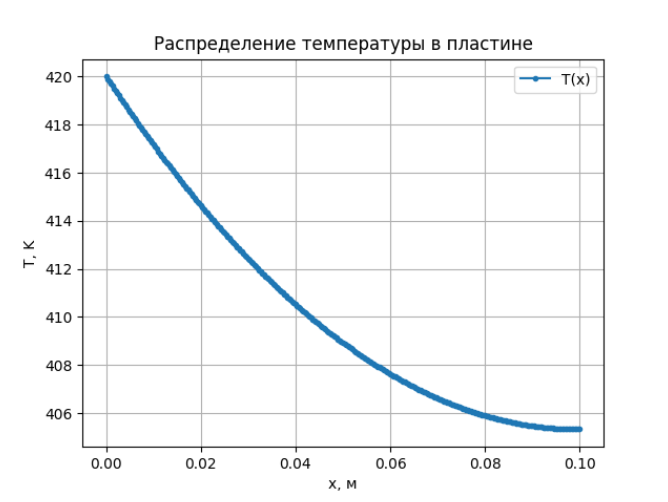

# Отчет по лабораторной №5: Краевые задачи для дифференциальных уравнений

## 1. Цели работы
- Закрепить навыки численного решения краевых задач для обыкновенных дифференциальных уравнений
- Освоить построение и анализ разностных схем, а также их программную реализацию для получения и исследования численных решений.

## 2. Ход работы и результаты численных экспериментов

### Разминка

**Рассмотрим краевую задачу:**

$$
    x^2 u'' + x u' + (x^2 - \nu^2)u = 0,\quad x \in [a, b]
$$

$$
    u(a) = 1,\quad u(b) = 0.
$$

Приведём данное уравнение к дивергентному виду:

$$
    \frac{d[x^2 u']}{dx} + (x^2 - \nu^2)u = xu'
$$

Данный вид не является строго дивергентным, так как справа присутствует $u'$. Это уравнение Бесселя порядка $\nu$.

---

#### Построение разностной схемы

Построим равномерную сетку:

$$
    x_i = a + ih,
$$

$$
     i = 0, 1, ... N,
$$

$$
    h = \frac{b-a}{N}.
$$

Аппроксимируем:

$$
    u' \approx \frac{u_{i+1} - u_{i-1}}{2h}
$$

$$
    \frac{d[k(x) u']}{dx} \approx \frac{k_{i+0,5}(u_{i+1} - u_i) - k_{i-0,5}(u_i - u_{i-1})}{h^2}
$$

где для $k(x) = x^2$ имеем:

$$
    k_{i \pm 0,5} = \frac{(x_i + x_{i \pm 1})^2}{4}
$$

**Таким образом получим итоговую разностную схему для уравнения Бесселя:**

$$
    \frac{k_{i+0,5}(u_{i+1} - u_i) - k_{i-0,5}(u_i - u_{i-1})}{h^2} + (x_i^2 - \nu^2)u_i = x_i \frac{u_{i+1} - u_{i-1}}{2h}
$$

---

#### Получение формул для элементов трёхдиагональной матрицы 

Общий вид: 

$$
    A_i u_{i-1} + B_i u_i + C_i u_{i+1} = 0
$$

Тогда согласно построенной нами разностной схемы имеем следующие формулы для элементов матрицы:

$$
    A_i = \frac{k_{i-0,5}}{h^2} + \frac{x_i}{2h},
$$

$$
    B_i = - \frac{k_{i-0,5} + k_{i+0,5}}{h^2} + x_i^2 - \nu^2,
$$

$$
    C_i = \frac{k_{i+0,5}}{h^2} - \frac{x_i}{2h}.
$$

Граничные условия заданы точно, а порядок аппроксимации основного уравнения - **второй**.

---

#### Решение полученной системы методом прогонки

Пусть:

$$
    u(1) = 1,\quad u(3) = 0
$$

---

**Для $\nu = 1$:**

**Рисунок 1 - График численного решения уравнения Бесселя первого порядка**

**Для $\nu = 1$:**

**Рисунок 2 - График численного решения уравнения Бесселя первого порядка**

**Для $\nu = 1$:**

**Рисунок 3 - График численного решения уравнения Бесселя первого порядка**

Результаты численного решения краевой задачи для уравнения Бесселя первого, второго и третьего порядков демонстрируют высокую точность и стабильность используемого алгоритма прогонки. Для обоих случаев ($\nu = 1$, $\nu = 2$ и $\nu = 3$) при числе узлов $100$ величина невязки составила $4.0957 \times 10^{-12}$, $2.6504 \times 10^{-12}$ и $1.3691 \times 10^{-12}$ соответственно, что свидетельствует о практически полном совпадении численного решения с аналитическим эталоном.

### Основное блюдо

Рассмотрим следующую задачу:

К горячей стенке присоединена прямоугольная пластина (параллелепипед) как показано на рисунке 4. Начало координат положено на стенке. Левый край пластины поддерживается при постоянной температуре, правый — теплоизолирован. На остальной поверхности происходит конвективный теплообмен с окружающей средой.

**Рисунок 4 - К постановке задачи о распределении температуры**

---

#### Постановка краевой задачи

Получим уравнение, описывающее процесс распределения температуры в данной системе.

Рассмотрим участок между $x$ и $x + dx$. Тогда входящий и выходящий поток имеют вид:

$$
    q_x = -kA \frac{dT}{dx} - входящий
$$

$$
    q_{x+dx} = -kA\left. \frac{dT}{dx} \right|_{x+dx} - выходящий 
$$

где $k$ - коэффициент теплопроводности, $A$ - площадь поперечного сечения пластины.

Зададим потери на конвекцию:

$$
    hPdx(T(x) - T_{\infty})
$$

где $h$ - коэффициент теплоотдачи, $Р$ - периметр поперечного сечения пластины, $T_{\infty}$ - температура окружающей среды.

Закон сохранения энергии:

$$
    q_x - q_{x+dx} - hPdx(T(x) - T_{\infty}) = 0
$$

Тогда, подставляя выражения для потоков, получим:

$$
    kA[\left. \frac{dT}{dx} \right|_{x+dx} - \left. \frac{dT}{dx} \right|_{x}] = hPdx(T(x) - T_{\infty})
$$

По определению производной функции в точке:

$$
    \left. \frac{dT}{dx} \right|_{x+dx} - \left. \frac{dT}{dx} \right|_{x} \approx \frac{d^2T}{dx^2}dx
$$

**Таким образом, итоговое уравнение, описывающее распределение температуры в данной системе имеет вид:**

$$
    \frac{d^2T}{dx^2} - \frac{hP}{kA}(T(x) - T_{\infty}) = 0,\quad x \in [0, L]
$$

**Граничные условия:**

$$
    T(0) = T_b
$$

$$
    T'(L) = 0
$$

---

#### Обезразмеривание задачи 

Прежде чем решать колченную краевую задачу, с целью получения универсального решения, зависящего только от _числа Биота_, а не от конкретных физических параметров системы, приведём её к безразмерному виду.

_Число Биота_ отражает отношение интенсивности конвективного теплоотвода к теплопроводности пластины:

$$
Bi = \frac{h P L^2}{k A}
$$

Значение $Bi$ определяет характер распределения температуры и позволяет обобщать результаты для различных физических параметров.

Введем безразмерную температуру $\theta(x)$ и координату $\xi$:

$$
    \theta(x) = \frac{T(x) - T_{\infty}}{T_b - T_{\infty}}
$$

$$
    \xi = \frac{x}{L}
$$

Выразим производную по $x$ через производную по $\xi$:

$$
    \frac{d}{dx} = \frac{d\xi}{dx}\frac{d}{d\xi} = \frac{1}{L}\frac{d}{d\xi}
$$

Тогда:

$$
    \frac{d^2T}{dx^2} = \frac{1}{L^2}\frac{d^2T}{d\xi^2}
$$

Собирая все вместе, получим:

$$
    \frac{1}{L^2}\frac{d^2T}{d\xi^2} - \frac{hP}{kA}(T_b - T_{\infty})\theta(\xi) = 0
$$

$$
    \frac{d^2\theta}{d\xi^2} - \frac{hP}{kA}L^2\theta(\xi) = 0
$$

**Итоговый вид обезразмеренной задачи:**

$$
    \frac{d^2\theta}{d\xi^2} - Bi\theta(\xi) = 0
$$

$$
    \xi \in [0, 1]
$$

$$
    \theta(0) = 1 \quad \theta'(L) = 0
$$

---

#### Дискретизация задачи 

Дискретизируем полученную обезразмеренную задачу методом конечных разностей. Для этого строим равномерную сетку:

$$
    \xi_i = ih, \quad i = 0, 1, ... n
$$

$$
    h = \frac{1}{n}
$$

Аппроксимируем производную:

$$
    \frac{d^2\theta}{d\xi^2} \approx \frac{\theta_{i+1} - 2\theta_i + \theta_{i-1}}{h^2}, \quad i \in [1, n-1]
$$

**В итоге имеем:**

$$
    \frac{\theta_{i+1} - 2\theta_i + \theta_{i-1}}{h^2} - Bi\theta_i = 0
$$

$$
    \theta_0 = 1, \quad \theta_n = \theta_{n-1}
$$

**Возврат к размерным величинам:**

$$
    T_i = T_{\infty} + (T_b - T_{\infty})\theta_i
$$

$$
    x_i = \xi_iL
$$

---

#### Получение формул для элементов матрицы 

Общий вид: 

$$
    A_i \theta_{i-1} + B_i \theta_i + C_i \theta_{i+1} = 0
$$

Тогда согласно построенной нами разностной схемы имеем следующие формулы для элементов матрицы:

$$
    A_i = \frac{1}{h^2},
$$

$$
    B_i = -\frac{2}{h^2} - Bi,
$$

$$
    C_i = \frac{1}{h^2}.
$$

---

#### Построение графиков распределений температуры в пластине 

Для

$$
    Bi = 0.25 \quad
$$

$$
    T_b = 420 K, \quad T_{\infty} = 290 K
$$

$$
    L = 0.1 м
$$

**имеем следующие распределения температуры:**

**Рисунок 5 - Распределение температуры в пластине**

---

**Исследуем, как меняется решение при изменении шага сетки:**

**Рисунок 6 - Распределение температуры при количестве узлов N = 5**

**Рисунок 7 - Распределение температуры при количестве узлов N = 20**

**Рисунок 8 - Распределение температуры при количестве узлов N = 200**

**Рисунок 9 - Распределение температуры при количестве узлов N = 300**

Линии, рассчитанные при малом числе узлов $N = 5$, $N = 20$, имеют видимую «ступенчатость» и заметно расходятся с более гладкими решениями для крупных сеток $N = 200$, $N = 300$. По мере роста числа узлов результаты постепенно «сходятся» и приближаются к аналитическому виду; при $N = 300$ дальнейшее увеличение N почти не изменяет форму профиля температуры.

Это свидетельствует о сходимости численного метода: при уменьшении шага сетки (увеличении $N$) погрешности аппроксимации убывают, и решение становится достоверным. График наглядно демонстрирует, что для получения точного результата необходимо использовать достаточно мелкую сетку, а дальнейшее повышение $N$ становится избыточным с точки зрения качества решения.

---

## 4. Заключение и выводы 

В ходе лабораторной работы были успешно реализованы и протестированы численные алгоритмы для решения краевых задач второго порядка, включая уравнение Бесселя и задачу о распределении температуры в прямоугольной пластине. Проведённое обезразмеривание тепловой задачи позволило выделить ключевой безразмерный параметр — число Биота, что существенно упростило анализ и сравнение результатов для различных физических конфигураций.

В результате дискретизации и решения задачи на разных сетках подтверждена сходимость численного метода: при увеличении числа узлов распределения температуры становятся гладкими и близкими к аналитическому решению, а погрешность заметно падает. Графики наглядно показывают, как количество шагов сетки влияет на точность и качество численных решений.

Реализованные визуализации позволили провести качественный анализ поведения решений и погрешностей, подтвердив корректность и точность выбранного численного подхода.
